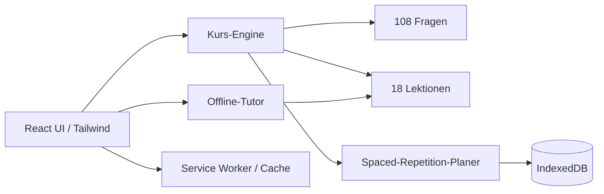

# Architektur und Datenmodell

## Datenmodell

- `Lesson`: Stufe, Modul, Titel, Lernzeit, Pflichtstatus, Erklärung, Truja-Beispiel, Grafik, Zusammenfassung, Lernkarten, Schlüsselbegriffe.
- `Question`: Lektion, Fragetyp, Prompt, Optionen, richtige Antwort, Erklärung, Schwierigkeit.
- `CardProgress`: Aufrufe, richtige/falsche Antworten, Lernstufe, Fälligkeitszeitpunkt, letzte Bearbeitung.
- `Progress`: Kartenstände, abgeschlossene Kapitel, XP, Serie, Lernzeit, Ziele, Prüfungsergebnisse.

## Spaced Repetition

Stufen: 0, 1, 2, 3, 4, 5, 6. Intervalle: sofort, 1, 3, 7, 14, 30, 90 Tage. Eine falsche Antwort setzt die Stufe auf 0. Eine richtige Antwort hebt sie um eine Stufe an.
