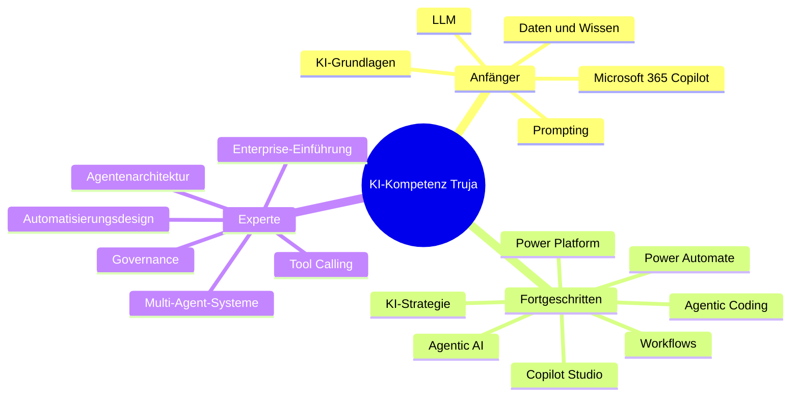

# Lernlandkarte und Empfehlungen

## Mindmap

## Zwingend
KI/LLM-Grundlagen, Prompting, Copilot, Datenqualität, Berechtigungen, Prozessanalyse, Agentenplanung, Tool-Risiken, Governance, Test und Abnahme.

## Optional vertiefen
Multi-Agent-Systeme, produktive Backend-Entwicklung, Hosting, komplexes Deployment und eigene Modellanpassungen. Diese Themen sollten fachlich verstanden, für den Produktivbetrieb aber regelmäßig delegiert werden.

## Kompetenzmodell
1. Anwender: KI sicher und produktiv nutzen.
2. Prozessgestalter: geeignete Abläufe, Daten und Kontrollen definieren.
3. Lösungsowner: Piloten planen, abnehmen und betreiben.
4. KI-Stratege: Portfolio, Governance, Plattform und Adoption führen.
